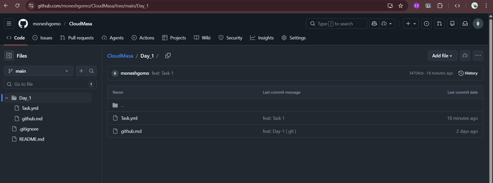

## Task 1

- Create a new file 
- Stage and commit the file 
- Then push to the remote repository


``` bash

PS C:\Intern\CloudMasa\Day_1> ls


    Directory: C:\Intern\CloudMasa\Day_1


Mode                 LastWriteTime         Length Name
----                 -------------         ------ ----
-a----        16-02-2026  10:55 AM           4236 github.md
-a----        16-02-2026  11:27 AM             39 Task.yml


PS C:\Intern\CloudMasa\Day_1> git add .\Task.yml
PS C:\Intern\CloudMasa\Day_1> git commit -m "feat: Task 1"
[main 34704cb] feat: Task 1
 1 file changed, 3 insertions(+)
 create mode 100644 Day_1/Task.yml
PS C:\Intern\CloudMasa\Day_1> git push origin main
Enumerating objects: 6, done.
Counting objects: 100% (6/6), done.
Delta compression using up to 12 threads
Compressing objects: 100% (3/3), done.
Writing objects: 100% (4/4), 433 bytes | 144.00 KiB/s, done.
Total 4 (delta 0), reused 0 (delta 0), pack-reused 0 (from 0)
To https://github.com/moneshgomo/CloudMasa.git
   ca23caa..34704cb  main -> main
PS C:\Intern\CloudMasa\Day_1>

```



